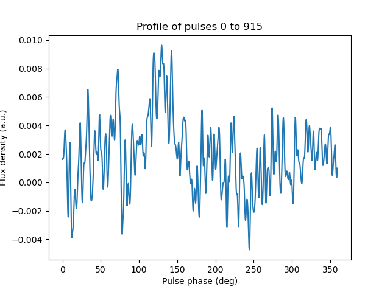
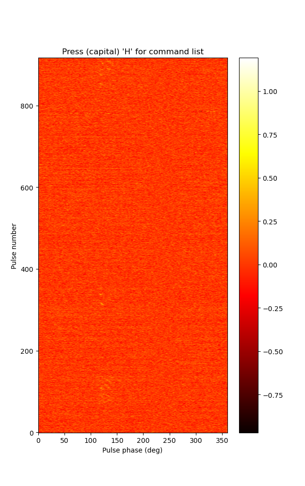

# Processing observation 1275172216 to look for single pulses

This is in response to the referee, who queried whether or not we were possibly getting an inaccurate nulling fraction by not looking for single pulses in 1275172216.

See also the parallel [README for 1275094456](../1275094456/README.md).

## Tasks

* [x] Download data
* [x] Manually recombine
* [x] Get calibration solution (1275172096, according to [Nick's spreadsheet](https://docs.google.com/spreadsheets/d/16bHhlqrGllyq_PD3Fb717MJfGCB1JFrUt2Ra2vPpWQE/edit#gid=0))
* [x] Beamform
* [x] Splice channels
* [x] Fold (DSPSR)
* [x] Make pulsestack
* [x] Look for pulses
* [x] Remove raw data

## Log

### 2022-02-21

Attempting to figure out why recombine is broken.

```
module use /pawsey/mwa/software/python3/modulefiles
module load vcstools
process_vcs.py -m recombine -o 1275172216 -a
```

Tracing down the error in the log files, it appears that cfitsio was not being found. Sure enough, nothing in the modules that *were* being loaded included cfitsio.
Thus, I added (back?) the line `load("cfitsio/3450")` in the file `/pawsey/mwa/software/python3/modulefiles/mwa-voltage/master.lua`.
I'm re-running now, and it appears to be working.

### 2022-02-22

#### Beamform
```
process_vcs.py -m beamform -a -o 1275172216 -O 1275172096 -p "00:26:37.30_-19:56:27.63"
```

#### Splice channels
```
cd /astro/mwavcs/vcs/1275172216/pointings/00:26:37.30_-19:56:27.63
splice.sh
> Project ID [G0024]: D0029
> Observation ID: 1275172216
> Pointing [None]: 00:26:37.30_-19:56:27.63
> Number of 200-second chunks [2]: 6
> Lowest coarse channel number [133]: 109
> Highest coarse channel number [156]: 132
```

#### Fold (DSPSR)
Copy the par file (0024.par, from the root directory of this repo) to Garrawarla, as well as the dspsr.batch script in this directory. Then,
```
sbatch dspsr.batch
```

### 2022-02-23

#### Make pulsestack
```
# Set up
cd /astro/mwavcs/vcs/1275172216/pointings/00:26:37.30_-19:56:27.63/single
module load singularity

# Frequency scrunch and combine archives
singularity run -B ~/.Xauthority /pawsey/mwa/singularity/psrchive_tempo2/psrchive_tempo2.sif pam -e F -D -F pu*.ar
singularity run -B ~/.Xauthority /pawsey/mwa/singularity/psrchive_tempo2/psrchive_tempo2.sif psradd -o 1275172216.F pu*.F
# 
```
The resulting file (1275172216.F) is added to this repo.

#### Look for pulses
Make a `pdv` file (on my local machine):
```
pdv -tK 1275172216.F > 1275172216.pdv
```
I then used [DriftAnalysis](https://github.com/robotopia/drift_analysis) to make the final pulsestack (image):
```
python ~/src/drift_analysis/drift_analysis.py 1275172216.pdv I
```
(The json file is in the `drift_analysis` folder.)
Using DriftAnalysis, the profile and pulsestack (smoothed with a 1D gaussian, sigma = 1 deg) are shown here:



Clearly, there is some emission there.
The detection is faint, which will make it difficult to decide what the nulling fraction is for this observation,
but by eye, I can make out maybe four distinct sequences, whose profiles are also included in this repo.

| Start pulse | End pulse | Number of pulses |
| :---------: | :-------: | :--------------: |
|  69 | 138 |  70 |
| 311 | 339 |  29 |
| 685 | 696 |  12 |
| 828 | 915 |  88 |
| Total | | 199 |

This pulsestack contains 917 pulses, giving a nulling fraction of 78.3%.
However, using the same method as I used for the other observations (finding and counting subpulses), I get a nulling fraction of 900/916 = 98.3%.
