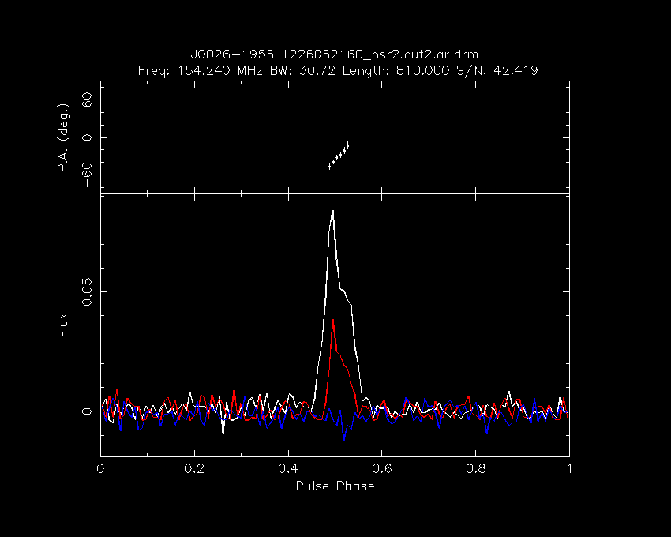

# Polarisation analysis

## Measuring the PA slope

To get an estimate of the PA slope across the profile, we simply fit a line across the few PA measurements obtained using PSRCHIVE for part of the observation (1226062160) when the pulsar was switched on (i.e. not nulling).

### Archive files

The prepared archives are/were stored in `/astro/mwavcs/pulsar_search/psr2_J0024-1932/pol_prof_forRB/` on Pawsey's filesystems.
The archives themselves are too big to store in this repo, but the metadata associated with them are given in [1226062160_psr2.cut1.ar.drm.psredit](1226062160_psr2.cut1.ar.drm.psredit) and [1226062160_psr2.cut2.ar.drm.psredit](1226062160_psr2.cut2.ar.drm.psredit).

### Time- and frequency-scrunching

They were then time- and frequency-scrunched, and "printed out" in ASCII:

```
pdv -tKTFZ 1226062160_psr2.cut1.ar.drm > 1226062160_psr2.cut1.ar.drm.pdv
pdv -tKTFZ 1226062160_psr2.cut2.ar.drm > 1226062160_psr2.cut2.ar.drm.pdv
```

The output files *are* stored in this folder.

### Plotting the polarisation profile

We make the polarisation profile plot using the PSRCHIVE tool `pav`.
We noted that if we use the automatic centering option (`-C`), the PA points did not look as good (= straight, with small errors) as if we rotated the profile manually to ensure that the amount shifted in phase was a whole number of bins:

```
pav -g 1226062160_psr2.cut2.pav.S.png/png -SFT -r 0.125 1226062160_psr2.cut2.ar.drm
```



You can see 6 PA points in a nice, neat row across the profile.

### Measuring the slope

The code used to measure the slope of the six points visible above is given in [measure_PA_slope.m](measure_PA_slope.m).
As of this writing, this code is specific to `1226062160_psr2.cut2.ar.drm.pdv`, and will not work out-of-the-box for a different data set, since it chooses the six points to fit "manually".
It uses standard weighted least squares, and is implemented in Octave:

```
octave measure_PA_slope.m
```

which gives the result: **2.4°/°**.
